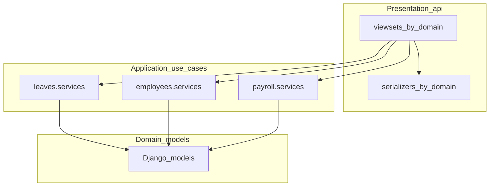

# Architecture

Pragmatic enterprise layering for this Django/DRF + React HRMIS. **Product deployment model: single organization** (English UI). Not a full hexagonal ports/adapters stack (no repository interfaces or duplicate entity DTOs).

Readiness scorecard: [ENTERPRISE_READINESS.md](ENTERPRISE_READINESS.md). Security program: [SECURITY_ASSURANCE.md](SECURITY_ASSURANCE.md).

## Layers

1. **Presentation (`api/`)** — HTTP only: routing, permissions, throttling, serializers, thin viewsets.
2. **Application (domain `services.py`)** — use-cases: submit leave, terminate employee, create salary in a payroll run, etc.
3. **Domain models** — Django models and field-level constraints.

Shared infrastructure stays in `api/` (`mixins`, `permissions`, `audit`, `notifications`, `validation`) and `accounts/access_control.py`.

## Package map

| Package | Responsibility |
|---------|----------------|
| `api/viewsets/*.py` | One module per domain (`employees`, `leaves`, `expenses`, `surveys`, …) |
| `api/serializers/*.py` | Matching domain serializers |
| `leaves/services.py` | Leave duration, accrual, `submit_leave` |
| `employees/services.py` | Create side-effects, `terminate_employee` |
| `payroll/services.py` | Draft runs, approve/pay, attach salary |
| `recruitment/services.py` | Pipeline stages, offers, onboarding, status updates |
| `expenses/services.py` | `submit_expense` (notify + approval start) |
| `attendance/services.py` | Clock/status derivation, submit/approve workflows |
| `performance/services.py` | Appraisal submit/approve, feedback rounds |
| `benefits/services.py` | Enrollment notification side-effects |
| `discipline/services.py` | Appeal submit/approve/reject |
| `surveys/services.py` | Active surveys, submit responses, results aggregation |
| `payroll/uganda.py` | Statutory calculation (pure domain math) |
| `workflows/services.py` | Approval engine |

Viewsets and serializers import explicitly per domain module (no shared `_imports.py` barrels).

**Service-split posture (modular monolith):** keep one deployable. Domain apps own models + `services.py`; `api/viewsets` stay thin HTTP adapters. Cross-cutting integration uses the transactional outbox (`events.DomainEvent` via `events.services.publish_event`) rather than extracting microservices.

Frontend: pages compose feature components under `frontend/src/components/<domain>/`; shared formatters live in `frontend/src/utils/`. E2E smoke tests in `frontend/e2e/` (Playwright), run in CI against Django-served SPA.

## Tenancy (optional)

- Default production use is **one employer** with unscoped users/employees (`organization_id=null`).
- `accounts.Organization` is optional infrastructure if you later need soft partitions.
- When set, org-bound users see only their organization on catalogs (`OrganizationQuerysetMixin`) and employee-linked rows (`scope_to_accessible_employees`).
- Admins with `organization_id=null` retain global visibility (normal single-org mode).

## Outbox

1. Use-case mutates data inside `transaction.atomic` when needed.
2. Call `publish_event(topic, payload)` in the same request/transaction boundary.
3. Cron/worker runs `python manage.py process_outbox` to drain pending rows (default handler logs; swap in webhook/queue fan-out).

## API contract

- OpenAPI schema: `GET /api/v1/schema/`
- Swagger UI: `GET /api/v1/docs/`
- Latency smoke tests in `api/tests/test_api_contract.py` guard hot paths (health, employee list).

## Adding a feature

1. Model change (if any) in the domain app + migration.
2. Use-case function in that app’s `services.py`.
3. Serializer validation in `api/serializers/<domain>.py`.
4. Thin viewset action in `api/viewsets/<domain>.py` that calls the service and audits.
5. Frontend via `frontend/src/api/client.js` + page/component.
