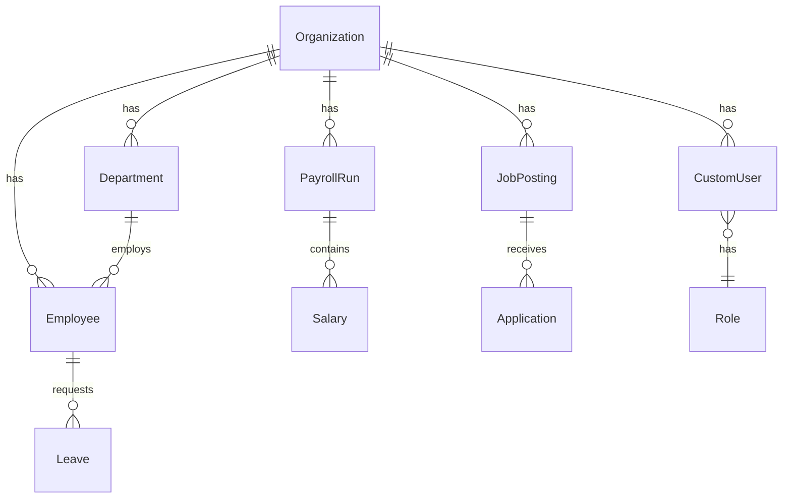

# Data dictionary

Core entities and organization tenancy. Nullable `organization` means single-tenant deployments (no org set) remain fully visible to unscoped admins.

## ER (core)

## Key tables

| Entity | App | Org scoped | Notes |
|--------|-----|------------|-------|
| Organization | accounts | n/a | Tenant root |
| CustomUser | accounts | yes | `organization` FK |
| Employee | employees | yes | Primary HR person record |
| Department | departments | yes | Org chart nodes |
| JobGrade / Position | employees | yes | Workforce structure |
| Leave / LeaveBalance | leaves | via employee | |
| LeavePolicy | leave_policies | yes | Catalog |
| PayrollRun / Salary | payroll | run yes / salary via employee | |
| JobPosting | recruitment | yes | Children via `job__organization` |
| Survey | surveys | yes | |
| Asset / Benefit / Shift | assets/benefits/shifts | yes | Catalogs |
| Skill / TrainingCourse / Certification | training | yes | |
| ExpenseCategory | expenses | yes | |
| ApprovalWorkflow | workflows | yes | |
| HRDocument | documents | yes | Also employee filter |
| SavedReport / Snapshot / Scheduled | reports | yes | |
| APIKey / WebhookEndpoint | integrations | yes | |
| FeedbackRound | performance | yes | |
| OpsAlertEvent | accounts | optional | Durable ops history |
| DomainEvent | events | n/a | Transactional outbox |

## Conventions

- Prefer filtering via `OrganizationQuerysetMixin` / `scope_to_accessible_employees`.
- Creating users/catalog rows under an org-bound admin stamps `organization_id`.
